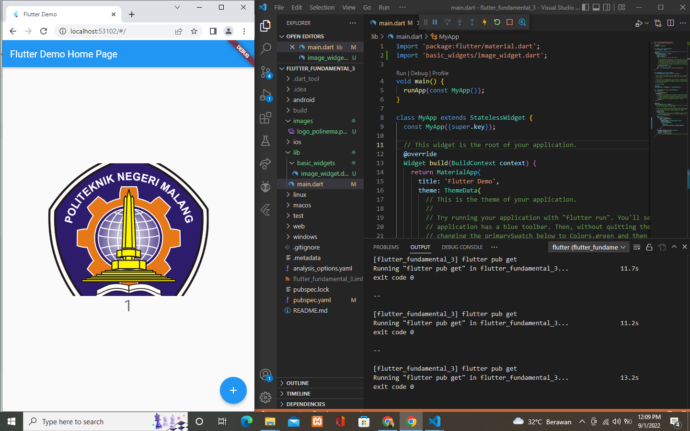
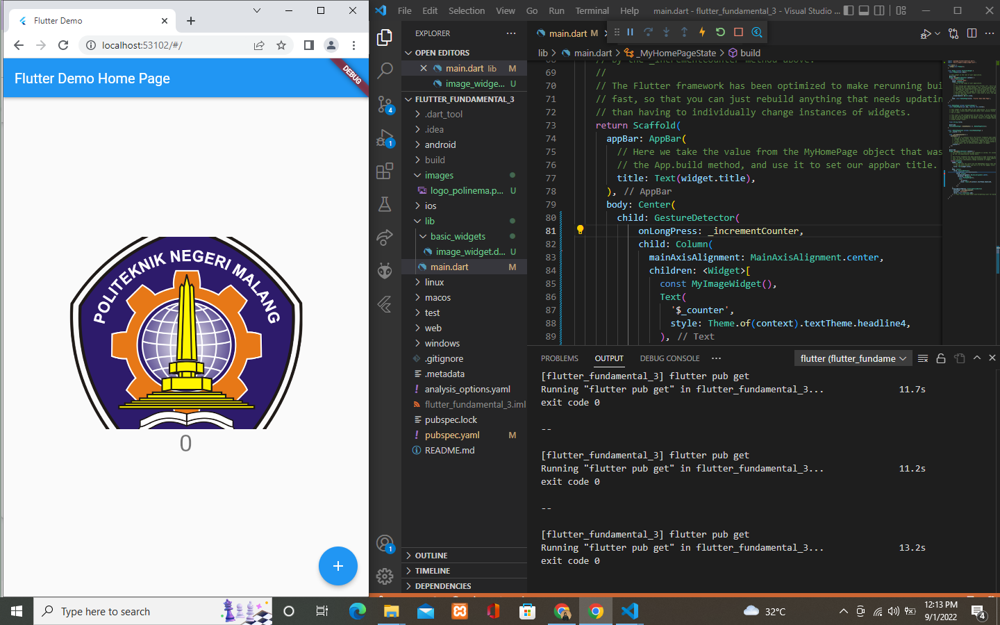
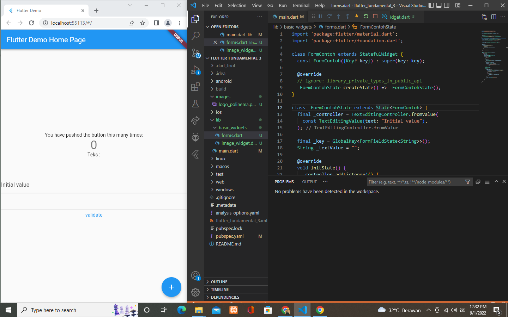
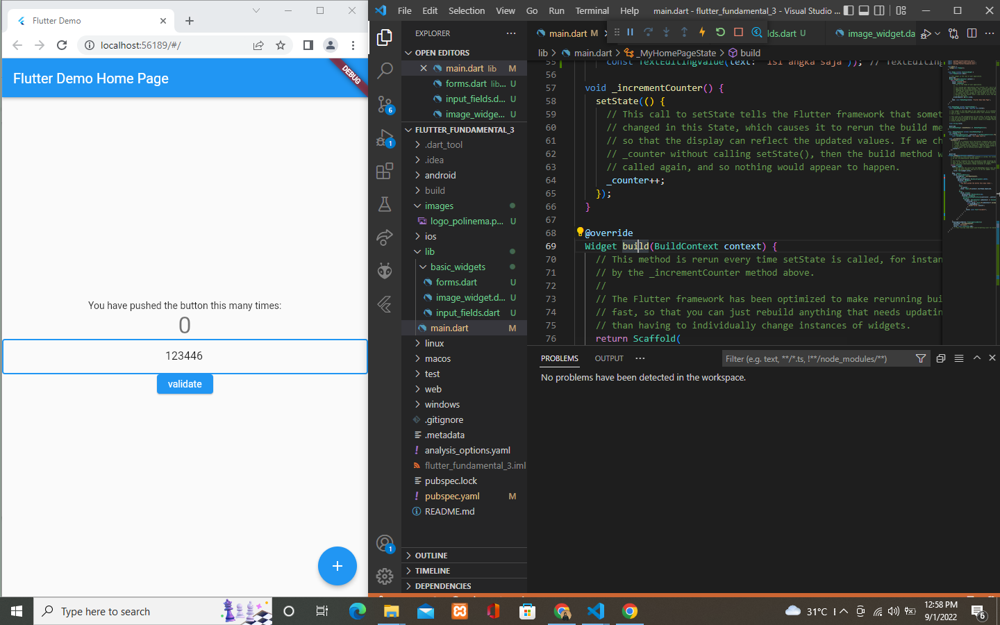

# flutter_fundamental_3

# Nama : Addina Nurul Mawaddah

## Praktikum 1 : Menerapkan Gestur Detector
 
### Menggunakan kode onTop
 
### Menggunakan kode onDoubleTap
 

## Praktikum 2 : Menerapkan Input widget dan forms
 

## Praktikum 3 : Menerapkan Custom  Input dan FormField Widget
 
